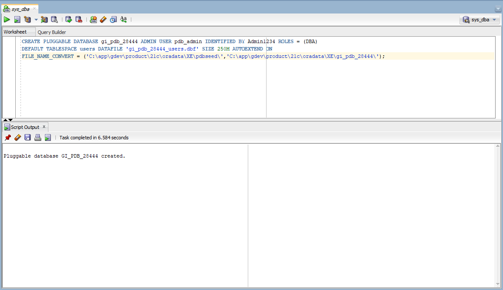
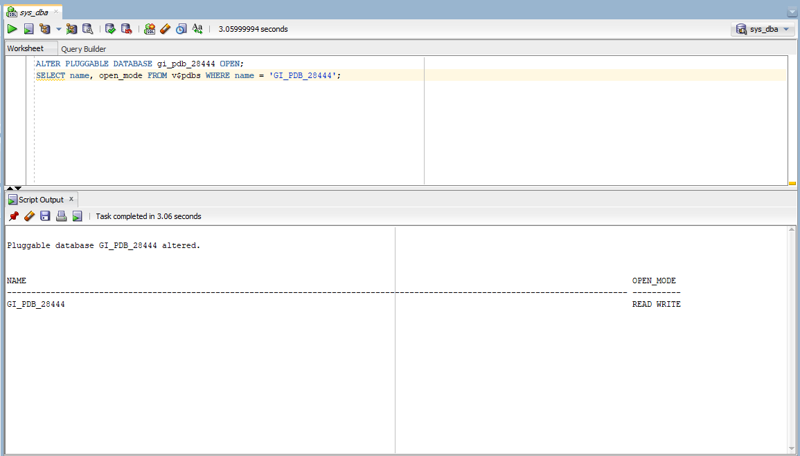
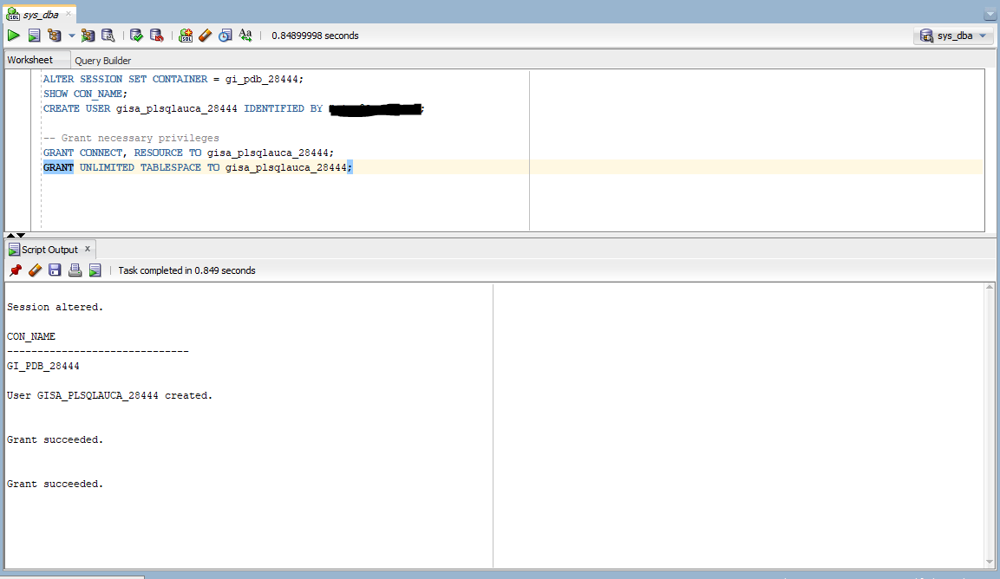
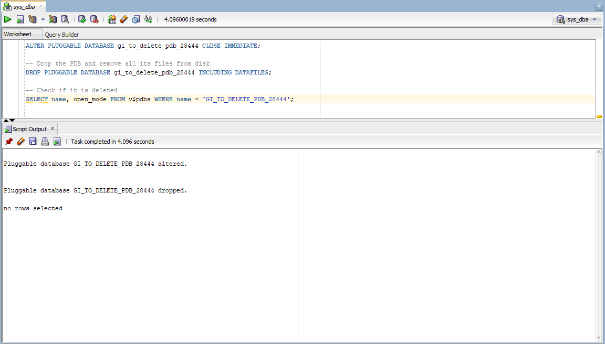
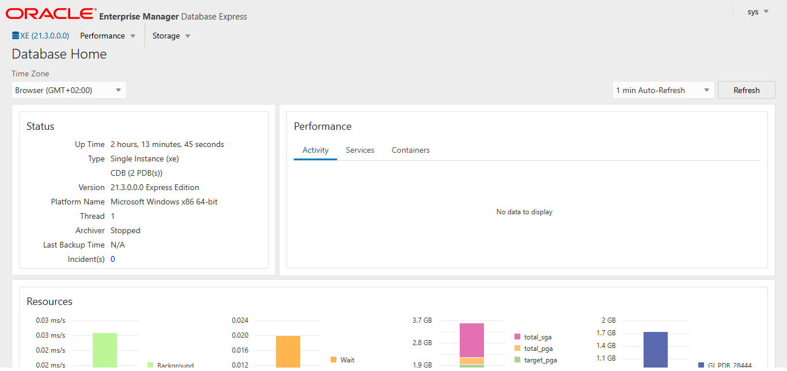

# Oracle Pluggable Database (PDB) Management

**Course:** Database Development with PL/SQL — INSY 8311  
**Institution:** Adventist University of Central Africa (AUCA)  
**Instructor:** Eric Maniraguha | eric.maniraguha@auca.ac.rw  
**Assignment:** Individual Assignment II  
**Student:** Gisa  
**Student ID:** 28444  
**Date:** February 2026

---

## Table of Contents

1. [Oracle Environment](#oracle-environment)
2. [Understanding Oracle Multitenant Architecture](#understanding-oracle-multitenant-architecture)
3. [Task 1 — Create Permanent PDB and User](#task-1--create-permanent-pdb-and-user)
4. [Task 2 — Create and Delete a Temporary PDB](#task-2--create-and-delete-a-temporary-pdb)
5. [Task 3 — Oracle Enterprise Manager (OEM)](#task-3--oracle-enterprise-manager-oem)
6. [Challenges Faced](#challenges-faced)
7. [Academic Integrity Statement](#academic-integrity-statement)

---

## Oracle Environment

| Property | Value |
|----------|-------|
| **Database Version** | Oracle Database Express Edition 21c |
| **Operating System** | Windows 10 (64-bit) |
| **Client Tool** | Oracle SQL Developer |
| **Container Database** | XE (default CDB created by Oracle XE installer) |
| **Default PDB** | XEPDB1 (ships with Oracle XE) |
| **OEM Access URL** | https://localhost:5500/em |

---

## Understanding Oracle Multitenant Architecture

Oracle's Multitenant Architecture separates the database into two layers. The **Container Database (CDB)** is the root installation and the shared foundation that holds everything together. Inside it, you can create multiple **Pluggable Databases (PDBs)**, each of which is a fully self-contained database with its own users, tables, schemas, and data.

Oracle XE ships with one default PDB called **XEPDB1** and one read-only template called **PDB$SEED**. Every new PDB you create is cloned from PDB$SEED. You never work inside PDB$SEED directly — it is only a blueprint.

---

## Task 1 — Create Permanent PDB and User

### Overview

This task creates a permanent pluggable database that will be used as the personal working environment for all future class sessions. A dedicated user account is created inside the PDB with the required naming convention.

**Naming conventions applied:**

| Item | Value |
|------|-------|
| PDB Name | `gi_pdb_28444` |
| Username | `gisa_plsqlauca_28444` |

---

### 1.1 — Create the Permanent PDB

The following command was executed while connected to the CDB as SYSDBA. It clones a new pluggable database from PDB$SEED, sets up an internal admin user, creates the default tablespace with a 250MB auto-extending data file, and maps the physical file paths from the seed location to the new PDB's storage location.

```sql
CREATE PLUGGABLE DATABASE gi_pdb_28444
  ADMIN USER pdb_admin IDENTIFIED BY Admin1234
  ROLES = (DBA)
  DEFAULT TABLESPACE users
    DATAFILE 'gi_pdb_28444_users.dbf' SIZE 250M AUTOEXTEND ON
  FILE_NAME_CONVERT = (
    'C:\app\gdev\product\21c\oradata\XE\pdbseed\',
    'C:\app\gdev\product\21c\oradata\XE\gi_pdb_28444\'
  );
```

The screenshot below shows the creation command and its successful execution output.

*Task 1.1 — Permanent PDB creation command and success output:*



---

### 1.2 — Open the PDB and Verify Status

A newly created PDB exists in a MOUNTED (closed) state. It must be opened before any connections can be made to it.

```sql
-- Open the PDB
ALTER PLUGGABLE DATABASE gi_pdb_28444 OPEN;

-- Verify the PDB is open using the dynamic performance view
SELECT name, open_mode
FROM v$pdbs
WHERE name = 'GI_PDB_28444';
```

The screenshot below shows the PDB with `open_mode` returning `READ WRITE`, confirming it is fully open and operational.

*Task 1.2 — PDB open state confirmed as READ WRITE:*



---

### 1.3 — Create User Inside the PDB

The session is switched into the PDB using `ALTER SESSION SET CONTAINER`.
```sql
-- Switch session into the PDB
ALTER SESSION SET CONTAINER = gi_pdb_28444;

-- Confirm current container
SHOW CON_NAME;

-- Create the assignment user / password is hidden
CREATE USER gisa_plsqlauca_28444 IDENTIFIED BY ******;

-- Grant necessary privileges
GRANT CONNECT, RESOURCE TO gisa_plsqlauca_28444;
GRANT UNLIMITED TABLESPACE TO gisa_plsqlauca_28444;
```

*Task 1.3 — User created inside the PDB:*



---

## Task 2 — Create and Delete a Temporary PDB

### Overview

This task demonstrates the full lifecycle management of a pluggable database — creation, verification, and complete removal including its physical data files. This is an important administrative skill, showing the ability to cleanly provision and decommission database environments.

**Naming convention applied:**

| Item | Value |
|------|-------|
| Temporary PDB Name | `gi_to_delete_pdb_28444` |

---

### 2.1 — Create the Temporary PDB

```sql
ALTER SESSION SET CONTAINER = CDB$ROOT;

-- Create the temporary PDB
CREATE PLUGGABLE DATABASE gi_to_delete_pdb_28444
  ADMIN USER pdb_admin IDENTIFIED BY Admin1234
  ROLES = (DBA)
  DEFAULT TABLESPACE users
    DATAFILE 'gi_to_delete_pdb_28444_users.dbf' SIZE 250M AUTOEXTEND ON
  FILE_NAME_CONVERT = (
    'C:\app\gdev\product\21c\oradata\XE\pdbseed\',
    'C:\app\gdev\product\21c\oradata\XE\gi_to_delete_pdb_28444\'
  );

-- Open it
ALTER PLUGGABLE DATABASE gi_to_delete_pdb_28444 OPEN;

-- Verify it exists and is open
SELECT name, open_mode FROM v$pdbs WHERE name = 'GI_TO_DELETE_PDB_28444';
```

The screenshot below shows the temporary PDB created and confirmed as `READ WRITE`.

*Task 2.1 — Temporary PDB created and verified as open:*


---

### 2.2 — Delete the Temporary PDB

Oracle requires a PDB to be closed before it can be dropped. The `CLOSE IMMEDIATE` command disconnects any active sessions instantly. The `INCLUDING DATAFILES` clause instructs Oracle to also delete the physical `.dbf` files from disk — without this, the files would remain on the hard drive even after the PDB is removed from the system.

```sql
-- Close the PDB
ALTER PLUGGABLE DATABASE gi_to_delete_pdb_28444 CLOSE IMMEDIATE;

-- Drop the PDB and remove all its files from disk
DROP PLUGGABLE DATABASE gi_to_delete_pdb_28444 INCLUDING DATAFILES;

-- Check if it is deleted
SELECT name, open_mode FROM v$pdbs WHERE name = 'GI_TO_DELETE_PDB_28444';
```

The screenshot below shows the DROP command executed successfully and the SELECT command returning no rows, confirming it has been deleted.

*Task 2.2 — Temporary PDB deleted and confirmed no longer exists:*



---

## Task 3 — Oracle Enterprise Manager (OEM)

### Overview

Oracle Enterprise Manager (OEM) is Oracle's browser-based graphical administration console. It provides a visual dashboard for monitoring database health, performance, resource usage, and the status of all pluggable databases.

---

### 3.1 — OEM Dashboard

OEM was accessed at `https://localhost:5500/em` using the SYS account with the SYSDBA role. The dashboard reflects the current Oracle environment including the CDB and the permanent PDB `gi_pdb_28444` created in Task 1.

**Access details used:**

| Field | Value |
|-------|-------|
| URL | https://localhost:5500/em |
| Username | SYS |
| Role | SYSDBA |
| Container | CDB$ROOT |

The screenshot below shows the OEM dashboard with the Oracle environment, database status, and the logged-in username visible.

*Task 3.1 — Oracle Enterprise Manager dashboard showing the database environment:*


---

## Challenges Faced

### Challenge 1 — FILE_NAME_CONVERT Path Resolution

**Problem:** The PDB creation command initially failed because the `FILE_NAME_CONVERT` paths did not exactly match the actual location of PDB$SEED files on the local machine.

**Solution:** The correct path was found by querying the dynamic performance view directly:
```sql
SELECT name FROM v$datafile WHERE con_id = 2;
```
This returned the exact path of the seed files, which was then used as the source path in `FILE_NAME_CONVERT`.

---

### Challenge 2 — PDB Status Showing NORMAL vs READ WRITE

**Problem:** Querying `CDB_PDBS` showed a status of `NORMAL` rather than `READ WRITE`, which caused initial confusion about whether the PDB was properly open.

**Solution:** `NORMAL` in `CDB_PDBS` refers to the health configuration state (as opposed to `UNUSABLE` or `NEEDS UPGRADE`). The actual open/closed runtime state is stored in `V$PDBS` under the `OPEN_MODE` column. Querying `V$PDBS` correctly returned `READ WRITE`, confirming the PDB was fully operational.

---

## Academic Integrity Statement

I, Gisa (Student ID: 28444), hereby declare that:

- All work documented in this repository represents my own individual effort
- All commands were executed personally on my local Oracle installation
- All screenshots were taken from my own environment and reflect my own execution
- No work was copied from classmates, shared repositories, or online sources
- No AI tools were used to generate commands or solutions without personal understanding and individual execution
- This repository complies with all academic integrity requirements of INSY 8311

**Student:** Gisa  
**Student ID:** 28444  
**Course:** INSY 8311 — Database Development with PL/SQL  
**Date:** February 2026